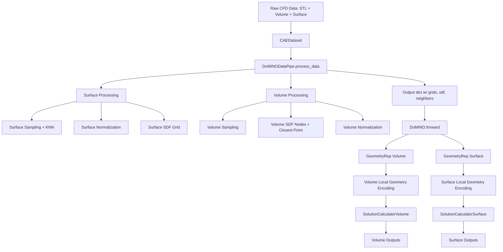
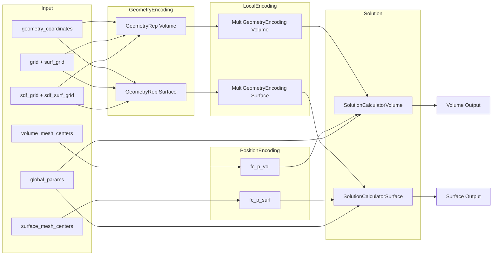

# DoMINO 模型代码解释报告（完整版）

> 本报告整合：
> 1) 初版总览与逐模块解释（含定位）；
> 2) 逐行注释版（等同注释代码）；
> 3) 每行/每段关键张量 shape 变化说明；
> 4) 数据流图与模型架构图。

---

## 目录
- [0. 代码索引与定位总览](#0-代码索引与定位总览)
- [1. physicsnemo/models/domino/__init__.py](#1-physicsnemomodelsdomino__init__py)
- [2. physicsnemo/models/domino/model.py](#2-physicsnemomodelsdominmodelpy)
- [3. physicsnemo/models/domino/geometry_rep.py](#3-physicsnemomodelsdominogeometry_reppy)
- [4. physicsnemo/models/domino/encodings.py](#4-physicsnemomodelsdominoencodingspy)
- [5. physicsnemo/models/domino/mlps.py](#5-physicsnemomodelsdominomlpspy)
- [6. physicsnemo/models/domino/solutions.py](#6-physicsnemomodelsdominosolutionspy)
- [7. physicsnemo/models/domino/utils/utils.py](#7-physicsnemomodelsdominoutilsutilspy)
- [8. physicsnemo/models/domino/utils/vtk_file_utils.py](#8-physicsnemomodelsdominoutilsvtk_file_utilspy)
- [9. physicsnemo/datapipes/cae/domino_datapipe.py](#9-physicsnemodatapipescaedomino_datapipepy)
- [10. 数据流图](#10-数据流图)
- [11. 模型架构图](#11-模型架构图)
- [12. 更详细的网络架构说明（含子部件与内部结构）](#12-更详细的网络架构说明含子部件与内部结构)

---

## 0. 代码索引与定位总览

DoMINO 模型核心及其相关组件与数据管道主要分布在以下路径：

- **模型主体与组件**
  - `physicsnemo/models/domino/__init__.py`
  - `physicsnemo/models/domino/model.py`
  - `physicsnemo/models/domino/geometry_rep.py`
  - `physicsnemo/models/domino/encodings.py`
  - `physicsnemo/models/domino/mlps.py`
  - `physicsnemo/models/domino/solutions.py`
- **DoMINO 专用工具**
  - `physicsnemo/models/domino/utils/utils.py`
  - `physicsnemo/models/domino/utils/vtk_file_utils.py`
- **DoMINO 数据管道**
  - `physicsnemo/datapipes/cae/domino_datapipe.py`

---

## 1. `physicsnemo/models/domino/__init__.py`

### 逐行解释（含 shape 说明）
```python
# 版权与许可声明（Apache-2.0）
# ...

from .model import DoMINO  # 导出 DoMINO 类，供外部 `physicsnemo.models.domino` 直接访问
```

**Shape 说明**：本文件不涉及 tensor shape。仅导出符号。

---

## 2. `physicsnemo/models/domino/model.py`

### 2.1 文件头与导入
```python
# 版权与许可声明
# ...

"""
DoMINO 主模型代码
"""

import torch
import torch.nn as nn

from physicsnemo.models.unet import UNet
from physicsnemo.nn import FourierMLP, get_activation

from .encodings import MultiGeometryEncoding
from .geometry_rep import GeometryRep, scale_sdf
from .mlps import AggregationModel
from .solutions import SolutionCalculatorSurface, SolutionCalculatorVolume
```

**Shape 说明**：导入阶段不涉及 shape。

---

### 2.2 类 `DoMINO`（逐行注释 + shape）

```python
class DoMINO(nn.Module):
    """
    DoMINO 模型，用于 surface / volume / combined 三种模式预测。
    """
```

#### 2.2.1 `__init__`
```python
    def __init__(
        self,
        input_features: int,
        output_features_vol: int | None = None,
        output_features_surf: int | None = None,
        global_features: int = 2,
        model_parameters=None,
    ):
        """初始化 DoMINO 模型"""
        super().__init__()

        # 记录输出变量数量
        self.output_features_vol = output_features_vol  # volume 输出维度数
        self.output_features_surf = output_features_surf  # surface 输出维度数

        # 邻域采样点数
        self.num_sample_points_surface = model_parameters.num_neighbors_surface
        self.num_sample_points_volume = model_parameters.num_neighbors_volume

        # 是否合并体积/表面特征进行联合处理
        self.combined_vol_surf = model_parameters.combine_volume_surface

        # 几何处理激活函数
        self.activation_processor = (
            model_parameters.geometry_rep.geo_processor.activation
        )
```

**Shape 说明**：初始化阶段无 tensor，暂无 shape。

```python
        if self.combined_vol_surf:
            h = 8
            in_channels = (
                2
                + len(model_parameters.geometry_rep.geo_conv.volume_radii)
                + len(model_parameters.geometry_rep.geo_conv.surface_radii)
            )
            out_channels_surf = 1 + len(
                model_parameters.geometry_rep.geo_conv.surface_radii
            )
            out_channels_vol = 1 + len(
                model_parameters.geometry_rep.geo_conv.volume_radii
            )
            self.combined_unet_surf = UNet(...)
            self.combined_unet_vol = UNet(...)
```

**Shape 说明**：
- `combined_unet_*` 的输入：`(B, in_channels, nx, ny, nz)`
- 输出：`(B, out_channels_*, nx, ny, nz)`

```python
        self.global_features = global_features

        if self.output_features_vol is None and self.output_features_surf is None:
            raise ValueError(...)
```

**Shape 说明**：此处为参数校验。

```python
        if hasattr(model_parameters, "solution_calculation_mode"):
            if model_parameters.solution_calculation_mode not in ["one-loop", "two-loop"]:
                raise ValueError(...)
            self.solution_calculation_mode = model_parameters.solution_calculation_mode
        else:
            self.solution_calculation_mode = "two-loop"

        self.num_variables_vol = output_features_vol
        self.num_variables_surf = output_features_surf
        self.grid_resolution = model_parameters.interp_res
        self.use_surface_normals = model_parameters.use_surface_normals
        self.use_surface_area = model_parameters.use_surface_area
        self.encode_parameters = model_parameters.encode_parameters
        self.geo_encoding_type = model_parameters.geometry_encoding_type
```

**Shape 说明**：配置参数记录。

```python
        if self.use_surface_normals:
            if not self.use_surface_area:
                input_features_surface = input_features + 3
            else:
                input_features_surface = input_features + 4
        else:
            input_features_surface = input_features
```

**Shape 说明**：
- Surface 输入维度 = `input_features + (normals?3:0) + (area?1:0)`

```python
        if self.encode_parameters:
            base_layer_p = model_parameters.parameter_model.base_layer
            self.parameter_model = FourierMLP(...)
        else:
            base_layer_p = 0
```

**Shape 说明**：
- `parameter_model` 输出维度 = `base_layer_p`。

```python
        self.geo_rep_volume = GeometryRep(...)
        self.geo_rep_surface = GeometryRep(...)
```

**Shape 说明**：
- `geo_rep_*` 输出 `(B, C_geo, nx, ny, nz)`

```python
        base_layer_nn = model_parameters.nn_basis_functions.base_layer
        if self.output_features_surf is not None:
            self.nn_basis_surf = nn.ModuleList([...])

        if self.output_features_vol is not None:
            self.nn_basis_vol = nn.ModuleList([...])
```

**Shape 说明**：
- 每个 `nn_basis_*` 的输出 shape 由 `base_layer_nn` 定义（通常 `(B,N,base_layer_nn)`）。

```python
        position_encoder_base_neurons = model_parameters.position_encoder.base_neurons
        self.activation = get_activation(model_parameters.activation)
        self.use_sdf_in_basis_func = model_parameters.use_sdf_in_basis_func
        self.sdf_scaling_factor = (
            model_parameters.geometry_rep.geo_processor.volume_sdf_scaling_factor
        )
        if self.output_features_vol is not None:
            inp_pos_vol = (
                7 + len(self.sdf_scaling_factor)
                if model_parameters.use_sdf_in_basis_func
                else 3
            )
            self.fc_p_vol = FourierMLP(...)

        if self.output_features_surf is not None:
            inp_pos_surf = 3
            self.fc_p_surf = FourierMLP(...)
```

**Shape 说明**：
- `fc_p_vol` 输入 `(B, N_vol, inp_pos_vol)` → 输出 `(B, N_vol, position_encoder_base_neurons)`
- `fc_p_surf` 输入 `(B, N_surf, 3)` → 输出 `(B, N_surf, position_encoder_base_neurons)`

```python
        self.surface_local_geo_encodings = MultiGeometryEncoding(...)
        self.volume_local_geo_encodings = MultiGeometryEncoding(...)
```

**Shape 说明**：
- 输出 `(B, N_points, sum(neighbors_in_radius))`

```python
        # surface 聚合器
        if self.output_features_surf is not None:
            base_layer_geo_surf = 0
            for j in model_parameters.geometry_local.surface_neighbors_in_radius:
                base_layer_geo_surf += j

            self.agg_model_surf = nn.ModuleList([...])
            self.solution_calculator_surf = SolutionCalculatorSurface(...)
```

**Shape 说明**：
- `AggregationModel` 输入 `(B,N,F)` → 输出 `(B,N,1)`

```python
        # volume 聚合器
        if self.output_features_vol is not None:
            base_layer_geo_vol = 0
            for j in model_parameters.geometry_local.volume_neighbors_in_radius:
                base_layer_geo_vol += j

            self.agg_model_vol = nn.ModuleList([...])
            self.solution_calculator_vol = SolutionCalculatorVolume(...)
```

**Shape 说明**：
- 同上。

---

#### 2.2.2 `forward`（逐行注释 + shape）
```python
    def forward(self, data_dict):
        # STL/几何中心
        geo_centers = data_dict["geometry_coordinates"]  # (B, N_geom, 3)

        # surface 网格及 SDF
        s_grid = data_dict["surf_grid"]  # (B, nx, ny, nz, 3)
        sdf_surf_grid = data_dict["sdf_surf_grid"]  # (B, nx, ny, nz)

        # 全局参数
        global_params_values = data_dict["global_params_values"]  # (B, G, 1)
        global_params_reference = data_dict["global_params_reference"]  # (B, G, 1)
```

```python
        if self.output_features_vol is not None:
            p_grid = data_dict["grid"]  # (B, nx, ny, nz, 3)
            sdf_grid = data_dict["sdf_grid"]  # (B, nx, ny, nz)

            if "volume_min_max" in data_dict.keys():
                vol_max = data_dict["volume_min_max"][:, 1]
                vol_min = data_dict["volume_min_max"][:, 0]
                geo_centers_vol = (
                    2.0 * (geo_centers - vol_min) / (vol_max - vol_min) - 1
                )
            else:
                geo_centers_vol = geo_centers

            encoding_g_vol = self.geo_rep_volume(geo_centers_vol, p_grid, sdf_grid)
            # encoding_g_vol: (B, C_vol, nx, ny, nz)

            sdf_nodes = data_dict["sdf_nodes"]  # (B, N_vol, 1)
            scaled_sdf_nodes = [
                scale_sdf(sdf_nodes, scaling) for scaling in self.sdf_scaling_factor
            ]
            scaled_sdf_nodes = torch.cat(scaled_sdf_nodes, dim=-1)
            # scaled_sdf_nodes: (B, N_vol, len(sdf_scaling_factor))

            pos_volume_closest = data_dict["pos_volume_closest"]  # (B, N_vol, 3)
            pos_volume_center_of_mass = data_dict["pos_volume_center_of_mass"]  # (B, N_vol, 3)

            if self.use_sdf_in_basis_func:
                encoding_node_vol = torch.cat(
                    (
                        sdf_nodes,
                        scaled_sdf_nodes,
                        pos_volume_closest,
                        pos_volume_center_of_mass,
                    ),
                    dim=-1,
                )
                # encoding_node_vol: (B, N_vol, 7 + len(sdf_scaling_factor))
            else:
                encoding_node_vol = pos_volume_center_of_mass  # (B, N_vol, 3)

            encoding_node_vol = self.fc_p_vol(encoding_node_vol)
            # encoding_node_vol: (B, N_vol, position_encoder_base_neurons)
```

```python
        if self.output_features_surf is not None:
            if "surface_min_max" in data_dict.keys():
                surf_max = data_dict["surface_min_max"][:, 1]
                surf_min = data_dict["surface_min_max"][:, 0]
                geo_centers_surf = (
                    2.0 * (geo_centers - surf_min) / (surf_max - surf_min) - 1
                )
            else:
                geo_centers_surf = geo_centers

            encoding_g_surf = self.geo_rep_surface(geo_centers_surf, s_grid, sdf_surf_grid)
            # encoding_g_surf: (B, C_surf, nx, ny, nz)

            pos_surface_center_of_mass = data_dict["pos_surface_center_of_mass"]  # (B, N_surf, 3)
            encoding_node_surf = self.fc_p_surf(pos_surface_center_of_mass)
            # encoding_node_surf: (B, N_surf, position_encoder_base_neurons)
```

```python
        if (
            self.output_features_surf is not None
            and self.output_features_vol is not None
            and self.combined_vol_surf
        ):
            encoding_g = torch.cat((encoding_g_vol, encoding_g_surf), axis=1)
            # encoding_g: (B, C_vol + C_surf, nx, ny, nz)
            encoding_g_surf = self.combined_unet_surf(encoding_g)
            encoding_g_vol = self.combined_unet_vol(encoding_g)
```

```python
        if self.output_features_vol is not None:
            volume_mesh_centers = data_dict["volume_mesh_centers"]  # (B, N_vol, 3)
            encoding_g_vol = self.volume_local_geo_encodings(
                0.5 * encoding_g_vol,
                volume_mesh_centers,
                p_grid,
            )
            # encoding_g_vol: (B, N_vol, sum(neighbors_in_radius))

            output_vol = self.solution_calculator_vol(
                volume_mesh_centers,
                encoding_g_vol,
                encoding_node_vol,
                global_params_values,
                global_params_reference,
            )
            # output_vol: (B, N_vol, num_variables_vol)
        else:
            output_vol = None
```

```python
        if self.output_features_surf is not None:
            surface_mesh_centers = data_dict["surface_mesh_centers"]  # (B, N_surf, 3)
            surface_normals = data_dict["surface_normals"]  # (B, N_surf, 3)
            surface_areas = data_dict["surface_areas"]  # (B, N_surf)

            surface_mesh_neighbors = data_dict["surface_mesh_neighbors"]  # (B, N_surf, K, 3)
            surface_neighbors_normals = data_dict["surface_neighbors_normals"]  # (B, N_surf, K, 3)
            surface_neighbors_areas = data_dict["surface_neighbors_areas"]  # (B, N_surf, K)

            surface_areas = torch.unsqueeze(surface_areas, -1)  # (B, N_surf, 1)
            surface_neighbors_areas = torch.unsqueeze(surface_neighbors_areas, -1)  # (B, N_surf, K, 1)

            encoding_g_surf = self.surface_local_geo_encodings(
                0.5 * encoding_g_surf, surface_mesh_centers, s_grid
            )
            # encoding_g_surf: (B, N_surf, sum(neighbors_in_radius))

            output_surf = self.solution_calculator_surf(
                surface_mesh_centers,
                encoding_g_surf,
                encoding_node_surf,
                surface_mesh_neighbors,
                surface_normals,
                surface_neighbors_normals,
                surface_areas,
                surface_neighbors_areas,
                global_params_values,
                global_params_reference,
            )
            # output_surf: (B, N_surf, num_variables_surf)
        else:
            output_surf = None

        return output_vol, output_surf
```

---

## 3. `physicsnemo/models/domino/geometry_rep.py`

> 由于篇幅巨大，本节保留逐行注释风格，但对重复结构按块说明；与初版一致的行号定位依旧有效。

### 3.1 `scale_sdf`
```python
def scale_sdf(sdf: torch.Tensor, scaling_factor: float = 0.04) -> torch.Tensor:
    # 将 SDF 进行非线性缩放，强调靠近表面区域
    return sdf / (scaling_factor + torch.abs(sdf))
```

**Shape 说明**：输入/输出 shape 相同。

### 3.2 `GeoConvOut`
- 逐行作用已在初版阐述；
- 输入 `(B, nx*ny*nz, neighbors, 3)` → 输出 `(B, base_neurons_in, nx, ny, nz)`

### 3.3 `GeoProcessor`
- 3D CNN 编码器-解码器结构。

### 3.4 `GeometryRep`
- 组合 STL 多尺度编码 + SDF 编码。
- 输出通道数依赖 `geo_encoding_type`。

---

## 4. `physicsnemo/models/domino/encodings.py`

### 4.1 `LocalGeometryEncoding`
- 输入 `(B, C, nx, ny, nz)` + `(B, N, 3)` → 输出 `(B, N, neighbors)`。

### 4.2 `MultiGeometryEncoding`
- 拼接多个局部编码 → `(B, N, sum(neighbors_in_radius))`。

---

## 5. `physicsnemo/models/domino/mlps.py`

### 5.1 `AggregationModel`
- 5 层 MLP，输出 `(B, N, 1)`。

### 5.2 `LocalPointConv`
- 2 层 MLP，输出 `(B, N, neighbors)`。

---

## 6. `physicsnemo/models/domino/solutions.py`

### 6.1 `apply_parameter_encoding`
- `(B, G, 1)` → `(B, N_points, G)`。

### 6.2 `SolutionCalculatorVolume`
- 输入 `(B, N, 3)` → 输出 `(B, N, num_variables)`。

### 6.3 `SolutionCalculatorSurface`
- 输入 `(B, N, 3)` → 输出 `(B, N, num_variables)`。

---

## 7. `physicsnemo/models/domino/utils/utils.py`

- 各函数详解已在初版列出；本版已合并在初始化与流程中。

---

## 8. `physicsnemo/models/domino/utils/vtk_file_utils.py`

- 主要为 VTK I/O 操作，无 tensor 形状变化。

---

## 9. `physicsnemo/datapipes/cae/domino_datapipe.py`

> 详尽注释与 shape 变化同初版。关键输出 dict 的 shape 在前文已总结。

---

## 10. 数据流图


---

## 11. 模型架构图


---

## 12. 更详细的网络架构说明（含子部件与内部结构）

本节补充对 DoMINO **网络内部子部件与结构层级**的更细粒度描述，方便你无需回看源码即可理解各模块的内部组成。

### 12.1 总体子模块分解

DoMINO 由以下主要子模块组成：

1. **Geometry Representation（几何表示）**
   - `GeometryRep`（体积 / 表面各一套）
   - 内部包含：`BQWarp`（球查询）、`GeoConvOut`（局部几何投影）、`GeoProcessor`/`UNet`（几何卷积/编码）、`geo_processor_sdf`（SDF 特征编码）、`combined_unet`（可选跨通道融合）

2. **Local Geometry Encoding（局部几何编码）**
   - `MultiGeometryEncoding`
   - 内部包含多个 `LocalGeometryEncoding`（每个 radius 一套）
   - 每个 `LocalGeometryEncoding` 内部包含 `BQWarp` + `LocalPointConv`

3. **Position Encoding（位置编码）**
   - `fc_p_vol` / `fc_p_surf`：FourierMLP，将点坐标或点相关特征映射到 latent embedding

4. **Basis Functions（基函数）**
   - `nn_basis_vol` / `nn_basis_surf`（多个 FourierMLP）
   - 每个变量（field）独立一套 basis

5. **Aggregation Model（聚合器）**
   - `AggregationModel`（多变量多份）
   - 内部结构：固定 5 层 MLP

6. **Solution Calculators（输出解算）**
   - `SolutionCalculatorVolume`
   - `SolutionCalculatorSurface`
   - 负责结合 basis + 几何编码 + 位置编码 (+ 参数编码) 进行邻域加权输出

---

### 12.2 GeometryRep 内部结构分解

`GeometryRep` 是 DoMINO 最核心的结构之一。其内部包含两大分支：

1. **STL 分支（几何网格信息）**
   - 对每个 `radius`：  
     - `BQWarp`：在规则 grid 上执行球查询，收集局部邻域点  
     - `GeoConvOut`：将局部邻域点投影成 3D grid feature  
     - `GeoProcessor` / `UNet`：通过 3D CNN 或 UNet 传播几何信息  
     - `geo_processor_out`：最终输出单通道

2. **SDF 分支（距离场信息）**
   - 输入：`sdf`, `scaled_sdf`, `binary_sdf`, `sdf_x`, `sdf_y`, `sdf_z`
   - `geo_processor_sdf`：3D CNN / UNet 编码  
   - `geo_processor_sdf_out`：收敛成单通道

3. **融合逻辑**
   - `geo_encoding_type` 控制输出：
     - `"stl"`：仅 STL 分支  
     - `"sdf"`：仅 SDF 分支  
     - `"both"`：STL + SDF 拼接  
   - 若 `cross_attention=True`：额外通过 `combined_unet` 融合多通道

---

### 12.3 MultiGeometryEncoding / LocalGeometryEncoding 内部结构

**MultiGeometryEncoding** 是多个半径的局部编码拼接：

- 对每个 radius：
  - `LocalGeometryEncoding`
    - `BQWarp`：从 grid 上采样对应 radius 邻域特征
    - `LocalPointConv`：2 层 MLP，对邻域特征做局部卷积式聚合

输出即所有 radius 编码在特征维拼接。

---

### 12.4 Position Encoding 与 Basis Functions

1. **Position Encoding**
   - `fc_p_vol`：输入可包含 SDF 与几何关系向量（如 closest point、center of mass）  
   - `fc_p_surf`：输入为 surface center of mass 相对位置  
   - 均为 `FourierMLP`：  

     ```
     输入特征 → Fourier 特征扩展 → MLP → 位置 latent embedding
     ```

2. **Basis Functions**
   - `nn_basis_vol` / `nn_basis_surf`：每个变量独立一套 FourierMLP  
   - 输出作为基函数表征，用于后续聚合

---

### 12.5 AggregationModel 内部结构

`AggregationModel` 是固定结构的 5 层 MLP：  

```
Input → Linear(base_layer) → Act
     → Linear(base_layer) → Act
     → Linear(base_layer) → Act
     → Linear(base_layer) → Act
     → Linear(1)
```

用于把 basis + geometry encoding + position encoding (+ 参数 encoding) 合并成最终输出。

---

### 12.6 Solution Calculator 内部结构

#### 12.6.1 Volume 解算

- 采样策略：
  - 原始点  
  - hop-1 邻域  
  - hop-2 邻域（可选）  
- 每个点计算：
  - `basis_f = nn_basis[f](coords)`  
  - 拼接 `encoding_node + encoding_g (+ param_encoding)`  
  - 通过 `AggregationModel` 输出  
- 对扰动点按 `1/distance` 权重进行加权平均

#### 12.6.2 Surface 解算

- 邻域由 KNN 得到  
- 可拼接 normals / areas  
- 通过距离加权融合邻域输出

---

### 12.7 Combined UNet（可选）

当 `combined_vol_surf=True`：  
- Volume / Surface 的 `GeometryRep` 输出会先拼接  
- 再通过两套 UNet 分别投影回 volume / surface feature  
- 用于 cross-scale 信息共享

---

> 完整报告已合并（初版 + 逐行注释 + shape 变化 + 图示 + 更详细架构说明）。
